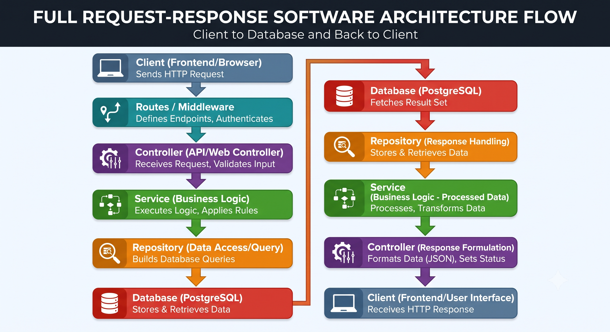
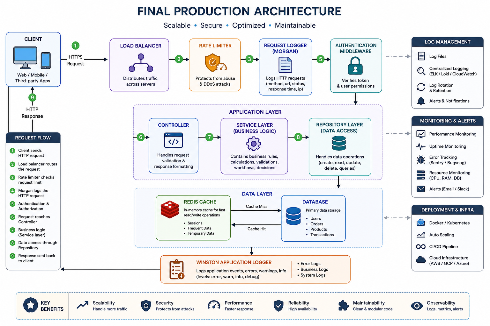
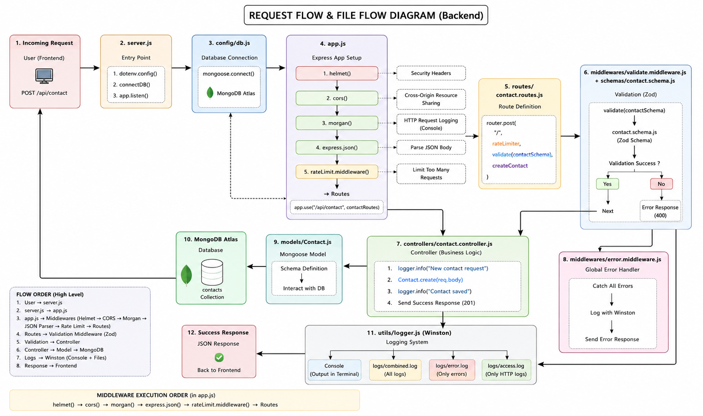

# 📘 Production Backend Engineering

## Industry-Ready Notes for Backend Developers

### Topics Covered

1. Clean Architecture
2. Logging Systems
3. Rate Limiting
4. API Optimization

---

## CHAPTER 1

### 1.1 What is Clean Architecture?

### Definition

**Clean Architecture** is a software design approach that organizes the backend into multiple independent layers, where each layer has a **single responsibility** and communicates only with adjacent layers.

Its primary objective is to make applications:

* Easy to understand
* Easy to maintain
* Easy to test
* Easy to scale
* Easy to extend

Instead of writing all the logic inside one file (Controller), Clean Architecture divides responsibilities into different layers.

---

### Why is Clean Architecture Needed?

Imagine a startup building an e-commerce application.

Initially, the backend consists of only 5 APIs:

* Login
* Register
* Add Product
* View Product
* Place Order

Everything works fine.

After one year, the application grows to:

* 350 APIs
* 50 Developers
* Payment Gateway
* Notifications
* Admin Panel
* Analytics
* AI Recommendation System
* Order Tracking
* Inventory Management

If all business logic is written inside controllers, the project becomes extremely difficult to maintain.

Common problems include:

* Massive controller files (1000+ lines)
* Duplicate code
* Difficult debugging
* High chance of introducing bugs
* Hard to onboard new developers
* Difficult unit testing

---

## Monolithic Controller (Bad Practice)

```javascript
loginUser(req,res){

    // validation

    // database query

    // password verification

    // jwt generation

    // logging

    // email sending

    // analytics

    // response

}
```

One function performs multiple responsibilities.

This violates the **Single Responsibility Principle (SRP)**.

---

## Single Responsibility Principle (SRP)

Every class or module should have **only one reason to change**.

Bad Example

```
Controller

Validation

Authentication

Database

Email

Logging

Response
```

Good Example

```
Controller

↓

Service

↓

Repository

↓

Database
```

Every layer performs exactly one responsibility.

---

## Core Layers of Clean Architecture

### 1. Routes Layer

Defines API endpoints.

Example

```
GET /users

POST /login

DELETE /products
```

Routes should never contain business logic.

They simply forward requests to controllers.

---

### 2. Controller Layer

The Controller acts as the **entry point** of every request.

Responsibilities

* Receive Request
* Validate Request
* Call Service Layer
* Return HTTP Response

Controllers should never communicate directly with the database.

---

### Example Flow

```
Client

↓

Controller

↓

Service
```

---

### 3. Service Layer

This is the **brain** of the application.

It contains all business rules.

Examples

* Can user place order?
* Is wallet balance sufficient?
* Can coupon be applied?
* Should GST be calculated?
* Is subscription active?

This layer contains the actual application logic.

---

### 4. Repository Layer

Responsible only for database communication.

Operations include

* Insert
* Update
* Delete
* Find
* Aggregate

Repository never performs calculations.

---

### 5. Database Layer

Stores application data.

Can be

* MongoDB
* PostgreSQL
* MySQL
* Oracle
* DynamoDB

Business logic should never depend on database implementation.

---

## Complete Request Flow




---

## Industry Example

Suppose your company migrates

MongoDB → PostgreSQL

Only Repository Layer changes.

Everything else remains unchanged.

This is one of the biggest advantages of Clean Architecture.

---

# Interview Questions

### Q1 Why should Controllers remain lightweight?

### Q2 Difference between Controller and Service Layer?

### Q3 Can Service directly call Database?

### Q4 Why Repository Pattern is used?


___

## CHAPTER 2

## Logging Systems

---

## Why Logging is Important?

Imagine an application receives 50,000 users daily.

A customer reports:

> "Payment failed."

How will you know why?

Without logs, debugging becomes almost impossible.

Logging records every important event happening inside your application.

---

## What is Logging?

Logging is the process of recording system activities for monitoring, debugging, auditing, and troubleshooting.

Examples

```
User Login

User Logout

Database Connected

Database Failed

Payment Successful

Payment Failed

JWT Expired

Server Started

Memory Usage
```

---

## Why Production Applications Require Logging

Without Logging

```
Bug

↓

Guess

↓

Trial & Error

↓

Hours Lost
```

With Logging

```
Bug

↓

Read Logs

↓

Identify Root Cause

↓

Fix Quickly
```

---

## Types of Logs

### Access Logs

Stores incoming HTTP requests.

Includes

* URL
* Method
* Status Code
* Response Time
* Client IP

---

### Application Logs

Stores business events.

Examples

```
User Registered

Password Changed

Order Placed

Coupon Applied
```

---

### Error Logs

Stores

* Stack Trace
* Exception
* Database Errors
* API Failures

---

### Security Logs

Stores

* Failed Login
* Unauthorized Access
* Brute Force Attempts

---

# Morgan

Morgan logs HTTP requests automatically.

Example

```
GET /users

Status : 200

Response Time : 45ms

IP : 192.168.1.15
```

Useful for tracking request activity.

---

# Winston

Winston records application events.

Example

```
Database Connected

Payment Failed

Redis Connected

JWT Verification Failed
```

Useful for debugging application logic.

---

# Morgan vs Winston

| Morgan           | Winston             |
| ---------------- | ------------------- |
| HTTP Logs        | Application Logs    |
| Automatic        | Manual              |
| Request Tracking | Business Events     |
| Lightweight      | Highly Configurable |

---

# Log Levels

```
INFO

WARN

ERROR

DEBUG

FATAL
```

Each level represents severity.

---

# What Should Never Be Logged?

Never log:

❌ Password

❌ OTP

❌ JWT Secret

❌ Credit Card Number

❌ CVV

❌ Aadhaar Number

❌ API Keys

---

## Prompt:

> Analyze these backend logs. Find recurring issues, classify them by severity, identify possible root causes, and suggest fixes.

## Interview Questions

Difference between Morgan and Winston?

Why should logs contain timestamps?

What information should never be logged?

---

## Hands-on

Implement Morgan Winston: Generate Success Logs, Error Logs, Access Logs

---

## CHAPTER 3

## Rate Limiting

---

## Why Rate Limiting?

Suppose an attacker sends

10000 Login Requests per second.

Consequences

* Server Crash
* High CPU Usage
* Database Overload
* Brute Force Attack

Rate Limiting protects APIs from abuse.

---

## Definition

Rate Limiting controls how many requests a client can make within a specific time period.

---

## Example

```
100 Requests

↓

1 Minute

↓

101st Request

↓

Rejected
```

Response

```
429: Too Many Requests
```

---

## Types

IP Based

User Based

Token Based

API Key Based

Device Based

---

If you're teaching **production backend engineering**, students should not only know the definitions—they should understand **why each algorithm exists, what problem it solves, how it works internally, its advantages/disadvantages, and how companies use it in production**.

---

# Rate Limiting Algorithms (Production Level)

Think of rate limiting like controlling the number of people entering a stadium.

Every algorithm answers one question differently:

> **"Can this request enter or should it wait/reject?"**

---

# 1. Fixed Window Algorithm

## Concept

Time is divided into fixed intervals (windows).

Example

```
Window = 1 Minute

10:00:00 ───────────────► 10:00:59
```

Suppose the limit is

```
100 Requests / Minute
```

A counter starts at zero.

Every request increments the counter.

If counter exceeds 100

```
Return

429 Too Many Requests
```

At

```
10:01:00
```

Counter becomes

```
0
```

again.

---

## Visualization

```
Minute 1

Requests

████████████████████████████
Counter = 100

Request 101

❌ Rejected


New Minute

Counter = 0

██████
Allowed Again
```

---

## Example

Limit

```
5 Requests / Minute
```

Timeline

```
10:00:05   Request 1 ✅
10:00:10   Request 2 ✅
10:00:20   Request 3 ✅
10:00:30   Request 4 ✅
10:00:40   Request 5 ✅
10:00:50   Request 6 ❌
```

At

```
10:01:00

Counter Reset

Request Allowed Again
```

---

## Simple JavaScript Example

```javascript
const LIMIT = 5;
let counter = 0;

setInterval(() => {
    counter = 0;
    console.log("Counter Reset");
}, 60000);

function request() {

    if (counter >= LIMIT) {
        console.log("429 Too Many Requests");
        return;
    }

    counter++;

    console.log("Allowed", counter);
}
```

Calling

```javascript
for(let i=0;i<7;i++){
    request();
}
```

Output

```
Allowed 1
Allowed 2
Allowed 3
Allowed 4
Allowed 5
429
429
```

---

## Problem (Burst Issue)

Imagine

```
Limit = 100 / Minute
```

User sends

```
100 requests at 10:00:59
```

Immediately after

```
100 requests at 10:01:01
```

Total

```
200 Requests

Within 2 Seconds
```

But system still allows it.

This is called

> **Boundary Burst Problem**

---

## Pros

✅ Easy

✅ Fast

✅ Very little memory

---

## Cons

❌ Burst traffic

❌ Unfair

---

## Real Usage

Small APIs

Internal Tools

Admin Panels

---

# 2. Sliding Window Algorithm

## Why was it created?

To solve Fixed Window's burst problem.

Instead of fixed minutes,

it always checks

> "How many requests happened in the LAST 60 seconds?"

---

## Visualization

Current Time

```
10:01:30
```

Window

```
10:00:30 ------------------► 10:01:30
```

Only requests inside this range are counted.

Older requests are discarded.

---

## Example

Limit

```
5 Requests
```

Requests

```
10:00:40

10:00:50

10:01:00

10:01:10

10:01:20
```

Current time

```
10:01:30
```

Count

```
5

Next Request

❌ Reject
```

After 10 seconds

Current

```
10:01:40
```

Now request at

```
10:00:40
```

falls outside the window.

Count

```
4

New Request

✅ Allowed
```

---

## JavaScript Example

```javascript
const LIMIT = 5;
const WINDOW = 60000;

let requests = [];

function request() {

    const now = Date.now();

    requests = requests.filter(
        time => now - time < WINDOW
    );

    if(requests.length >= LIMIT){
        console.log("429");
        return;
    }

    requests.push(now);

    console.log("Allowed");
}
```

---

## Visualization

```
Timeline

|----|----|----|----|

● ● ● ● ●

Window

^^^^^^^^^^^^

Count = 5

New Request

❌
```

After few seconds

```
Old Dot Removed

● ● ● ●

Count = 4

New Request

✅
```

---

## Pros

✅ Fair

✅ Accurate

✅ No burst issue

---

## Cons

❌ Needs memory

❌ Slightly slower

---

## Used By

GitHub

Cloudflare

CDNs

Modern API Gateways

---

# 3. Token Bucket Algorithm ⭐

This is the **most common production algorithm** because it balances **burst traffic** with **overall rate limits**.

---

## Concept

Imagine a bucket.

```
Bucket Capacity

10 Tokens
```

Tokens are added continuously.

Example

```
1 Token Every Second
```

Each request needs

```
1 Token
```

No token

↓

Reject.

---

## Visualization

```
Bucket

🪣

OOOOOOOOOO

10 Tokens
```

User sends

```
3 Requests

Consume

OOO
```

Remaining

```
OOOOOOO

7 Tokens
```

After 3 seconds

```
+3 Tokens

Bucket Full Again
```

---

## Example

Capacity

```
5 Tokens
```

Refill

```
1 Token/sec
```

Initial

```
★★★★★
```

User sends

```
4 Requests

★★★★ → ☆
```

Remaining

```
★

1 Token
```

User sends

```
2 Requests
```

First

✅

Second

❌

After 5 seconds

```
★★★★★
```

Again

Allowed.

---

## JavaScript Example

```javascript
let tokens = 5;
const capacity = 5;

setInterval(() => {
    if(tokens < capacity){
        tokens++;
    }
},1000);

function request(){

    if(tokens <=0){
        console.log("429");
        return;
    }

    tokens--;

    console.log("Allowed",tokens);
}
```

---

## Why Companies Love It

Suppose

```
10 Requests / Second
```

A user remains idle.

Tokens accumulate.

Later,

User suddenly sends

```
20 Requests
```

The bucket already has saved tokens.

So

System allows

```
Burst Traffic
```

without breaking the long-term rate limit.

---

## Pros

✅ Handles bursts

✅ Very fair

✅ Production ready

✅ Highly scalable

---

## Cons

Slightly more complex

Requires refill logic

---

## Used By

AWS API Gateway

NGINX

Envoy

Kubernetes API Server

Cloudflare

Google APIs

---

# 4. Leaky Bucket Algorithm

Think of a water tank with a small hole.

Water enters quickly.

Water leaves slowly.

---

## Visualization

```
Incoming

↓↓↓↓↓↓↓↓↓↓↓↓↓

┌─────────────┐
│             │
│   Bucket    │
│             │
└──────┬──────┘
       ↓

1 Request / Second
```

Even if

```
100 Requests
```

arrive instantly,

Processing speed stays

```
1 Request / Second
```

---

## Example

Incoming

```
20 Requests

Immediately
```

Outgoing

```
1/sec

1

2

3

4

5
```

Remaining stay inside queue.

If queue becomes full

↓

Drop requests.

---

## JavaScript Example

```javascript
const queue = [];

setInterval(() => {

    if(queue.length > 0){

        const req = queue.shift();

        console.log("Processed", req);

    }

},1000);

function request(id){

    if(queue.length >=5){

        console.log("Queue Full");

        return;

    }

    queue.push(id);

}
```

---

## Pros

✅ Smooth traffic

✅ Predictable load

✅ Protects downstream services

---

## Cons

❌ Higher latency because requests wait in the queue

❌ Queue overflow may still lead to dropped requests

---

## Used By

Video Streaming

Message Queues

Networking Devices

Load Balancers

Payment Processing Systems

---

# Comparison Table

| Algorithm      | Burst Allowed            | Memory Usage | Accuracy | Speed | Best Use Case                             |
| -------------- | ------------------------ | ------------ | -------- | ----- | ----------------------------------------- |
| Fixed Window   | ❌ Poor (boundary bursts) | ⭐ Very Low   | ⭐⭐       | ⭐⭐⭐⭐⭐ | Simple APIs, internal tools               |
| Sliding Window | ⭐ Limited                | ⭐⭐⭐ High     | ⭐⭐⭐⭐⭐    | ⭐⭐⭐   | Public APIs, authentication endpoints     |
| Token Bucket   | ⭐⭐⭐⭐⭐ Yes                | ⭐⭐ Medium    | ⭐⭐⭐⭐     | ⭐⭐⭐⭐  | API Gateways, cloud services, mobile apps |
| Leaky Bucket   | ⭐ Controlled (queued)    | ⭐⭐⭐ Medium   | ⭐⭐⭐⭐     | ⭐⭐⭐   | Streaming, queues, payment systems        |

---

# Which One Should Students Remember for Interviews?

| Interview Question                                       | Best Answer      |
| -------------------------------------------------------- | ---------------- |
| Simplest algorithm?                                      | Fixed Window     |
| Solves burst issue?                                      | Sliding Window   |
| Most used in production APIs?                            | **Token Bucket** |
| Best for smoothing traffic and constant processing?      | Leaky Bucket     |
| Used by API gateways like AWS, NGINX, and Envoy?         | **Token Bucket** |
| Best when downstream systems need a steady request rate? | **Leaky Bucket** |

---

# Production Insight

In modern distributed systems, rate limiting is often implemented using **Redis** because it provides fast, atomic operations across multiple application servers. Common production patterns include:

* **Fixed Window:** Store a counter with an expiration (`INCR` + `EXPIRE`).
* **Sliding Window:** Store request timestamps in a **sorted set (ZSET)**, remove old entries, count the remaining timestamps, and decide whether to allow the request.
* **Token Bucket:** Store the current token count and last refill timestamp, calculate token replenishment on each request, then decrement atomically using a Lua script.
* **Leaky Bucket:** Push incoming requests into a queue (such as Redis Streams, RabbitMQ, or Kafka) and process them at a fixed rate using worker processes.

These production implementations ensure that rate limits remain consistent even when your application is running on multiple servers behind a load balancer.
---

This is actually a great exercise for students because it teaches them **how to use AI as an Engineering Assistant rather than a Code Generator**.

I recommend giving them a **production-grade prompt** that works with any AI (ChatGPT, Claude, Gemini, Cursor AI, GitHub Copilot, Windsurf, etc.).

---

# Prompt: Add Production-Ready Rate Limiting to an Existing Backend

```text
You are a Senior Backend Engineer with experience in building scalable production systems.

I already have an existing backend application.

Your task is to integrate a production-ready Rate Limiting mechanism into my project without breaking the existing functionality.

Requirements:

1. Analyze my project structure before writing code.

2. Identify all sensitive endpoints that should be protected, including but not limited to:
   - Login
   - Signup
   - Forgot Password
   - OTP Verification
   - Password Reset
   - Token Refresh
   - Public APIs
   - File Upload APIs

3. Recommend the most suitable Rate Limiting algorithm for my application from:
   - Fixed Window
   - Sliding Window
   - Token Bucket
   - Leaky Bucket

4. Explain WHY that algorithm is the best choice.

5. Implement the solution using production best practices.

6. The implementation should:
   - Return HTTP 429 when the limit is exceeded.
   - Include proper response messages.
   - Include Retry-After header if applicable.
   - Log rate-limited requests.
   - Be configurable using environment variables.

7. Make the solution scalable for multiple backend servers.

If my application runs behind multiple instances or Docker containers, explain whether Redis is required and integrate Redis-based rate limiting if necessary.

8. Handle edge cases:
- Reverse Proxy
- Load Balancer
- Shared IPs
- Localhost Development
- Cloud Deployment

9. Generate complete code with file names.

10. Explain how to install required packages.

11. Explain how to test using Postman

12. Explain how to verify that the limiter is working correctly.

13. Suggest production improvements such as:
- Redis
- Monitoring
- Logging
- Prometheus Metrics
- Grafana Dashboard
- Alerting
- DDoS Protection
- API Gateway Integration

14. Do not remove or modify existing project functionality.

Only integrate the rate limiting feature while keeping the application clean, maintainable, scalable, and production-ready.

Wait for my project files before generating code.
```

---

# Prompt (For Login Security)

This prompt makes students build a system like **Google, GitHub, Amazon, or banking applications**.

```text
Upgrade my authentication system to production level.

Implement intelligent rate limiting and brute-force attack protection.

Requirements:

• Maximum 5 failed login attempts in 15 minutes.
• Lock account for 30 minutes after repeated failures.
• Rate limit by both IP Address and Email.
• Prevent credential stuffing attacks.
• Prevent brute-force attacks.
• Add exponential backoff after repeated failures.
• Return secure error messages without revealing whether the email exists.
• Log suspicious login attempts.
• Store logs in database.
• Add audit logs.
• Automatically unblock users after timeout.
• Support Redis if available.
• Keep all values configurable through environment variables.
• Follow clean architecture.
• Generate production-ready code with explanations.
```

---

# AI Prompt for Any Existing ~Backend Project~ (Highly Reusable)

Students can prepend this to **any backend enhancement request**:

```text
Before writing any code:

1. Analyze my existing project structure.
2. Explain your implementation plan.
3. Identify which files need modification.
4. Create new files only if necessary.
5. Follow my existing coding style.
6. Avoid duplicate logic.
7. Use production best practices.
8. Write modular and reusable code.
9. Add proper error handling and logging.
10. Explain every major implementation step.
11. Ensure the solution is scalable, secure, and easy to maintain.
12. Do not break any existing functionality.
13. After implementation, provide testing steps and explain why your approach is production-ready.
```


# CHAPTER 4

# API Optimization

---

# Why Optimize APIs?

Slow APIs increase

* Bounce Rate
* Infrastructure Cost
* Response Time
* User Frustration

Performance directly impacts user experience.

---

# Factors Affecting Performance

Large JSON Response

No Database Index

Repeated Queries

Heavy Computation

Network Latency

Blocking Code

---

# Optimization Techniques

## Pagination

Instead of

100000 Records

Return

20 Records

---

## Projection

Return only required fields.

Instead of

```
User

Address

Orders

Payment

Reviews
```

Return

```
Name

Email
```

---

## Database Indexing

Indexes reduce search time significantly.

Without Index

```
O(n)
```

With Index

```
O(log n)
```

---

## Caching

Store frequently accessed data in memory.

Popular caching systems

* Redis
* Memcached

Benefits

* Faster response
* Reduced database load

---

## Compression

Compress responses using Gzip or Brotli.

Benefits

* Smaller payload
* Faster transfer
* Reduced bandwidth usage

---

## Connection Pooling

Instead of opening a new database connection for every request, reuse existing connections.

Advantages

* Lower latency
* Better scalability
* Reduced CPU usage

---

## Asynchronous Processing

Move heavy tasks like email sending, report generation, and image processing to background workers using queues (e.g., RabbitMQ, BullMQ, SQS).

Benefits:

* Faster API response
* Better user experience
* Improved scalability

---

## Monitoring Performance

Track:

* API Response Time
* CPU Usage
* Memory Consumption
* Database Query Time
* Error Rate
* Throughput

Popular tools:

* Prometheus
* Grafana
* New Relic
* Datadog

---

# API Optimization Checklist

✔ Use Pagination

✔ Use Database Indexes

✔ Return Only Required Fields

✔ Compress Responses

✔ Cache Frequently Used Data

✔ Optimize Database Queries

✔ Avoid N+1 Query Problems

✔ Use Connection Pooling

✔ Process Heavy Tasks Asynchronously

---

# Final Production Request Lifecycle

```
                 Client
                    │
                    ▼
            Load Balancer
                    │
                    ▼
             Rate Limiter
                    │
                    ▼
          Request Logger (Morgan)
                    │
                    ▼
     Authentication & Authorization
                    │
                    ▼
               Controller
                    │
                    ▼
          Service (Business Logic)
                    │
                    ▼
             Repository Layer
               │             │
               ▼             ▼
          Redis Cache     Database
               │             │
               └──────┬──────┘
                      ▼
        Winston Application Logs
                      │
                      ▼
              HTTP Response
```




---

# Production Backend Best Practices (Summary)

* Design your backend using **Clean Architecture** to separate responsibilities and improve maintainability.
* Implement **structured logging** with Morgan for HTTP requests and Winston for application events.
* Protect public APIs using **Rate Limiting** to prevent abuse and brute-force attacks.
* Optimize API performance with **pagination, indexing, caching, compression, connection pooling, and asynchronous processing**.
* Never expose sensitive information in logs, and always validate requests before they reach business logic.
* Monitor your application's health continuously using metrics, logs, and alerts.
* Build every backend assuming it will eventually serve **millions of users**, not just a classroom project.


# Enclave Portal Flow Diagram


